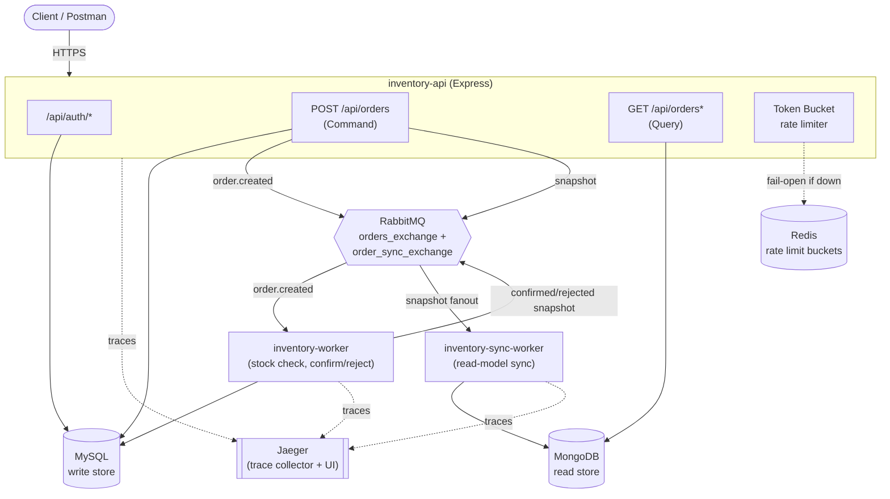

# Inventory & Order Management API

A high-scale, distributed backend built over a 6-week internship track: Domain-Driven Design → OAuth2.0 + RBAC → event-driven async processing → CQRS with a dedicated read store → Redis rate limiting + distributed tracing → chaos-tested resilience.

## Quick Start
```bash
git clone <this-repo>
cd inventory-order-api
cp .env.example .env          # edit DB_PASSWORD and JWT_ACCESS_SECRET at minimum
docker compose up --build     # spins up all 8 services: MySQL, RabbitMQ, MongoDB, Redis, Jaeger, API, Worker, Sync Worker
docker compose exec api npm run seed
```
API: `http://localhost:3000` · Docs: `http://localhost:3000/api-docs` · Jaeger: `http://localhost:16686` · RabbitMQ: `http://localhost:15672` (guest/guest)

Import `postman_collection.json` + `postman_environment.json` into Postman for a ready-to-run request set, or `openapi.json` for the raw OpenAPI 3.0 spec.

## Architecture Diagram



**Reading the diagram:** writes (`POST /api/orders`) go through the Command side into MySQL and publish two independent events over RabbitMQ — one triggers async stock processing (Worker), the other triggers read-model sync (Sync Worker). Reads (`GET /api/orders*`) never touch MySQL at all — they go straight to the MongoDB read store, kept eventually consistent by the Sync Worker. All three Node processes export traces to Jaeger, linked into single end-to-end traces across the RabbitMQ boundary via manual W3C Trace Context propagation.

## What Was Built, Week by Week
| Week | Focus | Key artifacts |
|---|---|---|
| 1 | DDD + layered architecture | `domain/`, strict `routes → controllers → services → repositories` flow |
| 2 | OAuth2.0-style auth + RBAC | JWT access tokens, sliding-window refresh rotation, `authenticate`/`authorize` middleware |
| 3 | Event-driven async processing | RabbitMQ, `worker.js`, exponential backoff + DLQ |
| 4 | CQRS + separate read store | `commands/`, `queries/`, MongoDB read model, `syncWorker.js` |
| 5 | Rate limiting + tracing | Redis Token Bucket (fail-open), OpenTelemetry + Jaeger |
| 6 | Chaos engineering + finalization | `scripts/chaosTest.js`, `RESILIENCE.md`, finalized OpenAPI + Postman |

## Architecture Goals
- **Domain-Driven Design**: business logic lives in `domain/`, isolated from Express and MySQL.
- **Layered architecture**: strict one-way dependency flow, `routes -> controllers -> commands/queries -> repositories -> domain`.
- **Aggregates**: `Order` and `InventoryItem` are separate aggregate roots. They reference each other only by ID (SKU), never by object reference.
- **Event-driven**: order creation is asynchronous — the API publishes, a Worker consumes (Week 3).
- **CQRS**: writes and reads go through entirely separate paths — a Command handler + MySQL for writes, Query handlers + MongoDB for reads (Week 4).
- **Resilient by design**: rate limiting and distributed tracing are layered in without becoming single points of failure — Redis being down degrades rate limiting, not the API (Week 5). Chaos-tested under Week 6 — see `RESILIENCE.md` for what actually held up and what didn't.

## Bounded Contexts
| Context   | Aggregate Root  | Owns                          |
|-----------|-----------------|--------------------------------|
| Ordering  | `Order`         | line items, order status, total |
| Inventory | `InventoryItem` | stock levels, pricing           |
| Auth      | `User`          | credentials, role               |

## Layer Rules
```
routes/       -> HTTP wiring only. No logic.
controllers/  -> req/res parsing + formatting. Calls a Command handler (writes) or Query handler (reads).
commands/     -> CQRS write side. Orchestrates domain + write-store repositories (MySQL).
queries/      -> CQRS read side. Reads ONLY from readmodel/ (MongoDB) — never MySQL, never the domain layer.
repositories/ -> raw SQL only (MySQL, write store). No business rules.
readmodel/    -> MongoDB read-store repository + the sync logic that keeps it eventually consistent.
domain/       -> Aggregates, Entities, Value Objects. Pure JS. Never imports express, mysql2, or mongodb.
config/       -> env validation (Zod), DB pool, Mongo client, Redis client, logger, Swagger spec, RabbitMQ topology.
middleware/   -> cross-cutting concerns (request logging, auth, RBAC, rate limiting).
events/       -> event publishers (API/Worker side of async handoffs — processing AND read-model sync).
worker/       -> pure, infra-free decision logic used by worker.js (e.g. retry policy).
scripts/      -> one-off ops scripts (DB seeding, read-latency benchmark, rate-limit load test).
tests/        -> integration + unit tests (Jest + Supertest).
worker.js       -> standalone process: consumes order.created, processes orders, handles retry/DLQ.
syncWorker.js   -> standalone process: consumes order snapshots, upserts the MongoDB read store.
server.js       -> standalone process: the HTTP API.
tracing.js      -> OpenTelemetry SDK init. Required FIRST by server.js/worker.js/syncWorker.js.
```

## Operational Tooling (Week 1 post-review additions)
- **`docker-compose.yml`** — brings up API + MySQL + RabbitMQ + MongoDB + both Workers together with one command.
- **`config/env.js`** — validates all required environment variables at startup using **Zod**; exits immediately with a clear error if config is missing or malformed.
- **`config/logger.js`** — structured JSON logging via **Winston**, replacing `console.log`.
- **`routes/healthRoutes.js`** — `/health/live` and `/health/ready` (checks DB connectivity too).
- **`scripts/seed.js`** — populates `inventory_items` with sample data (`npm run seed`).
- **`config/swagger.js`** + annotated routes — interactive OpenAPI docs served at `/api-docs`.

## Week 2: Auth (OAuth2.0-style) & RBAC

**Token model:**
- **Access tokens** — short-lived JWTs (default 15 min), self-contained, verified with no DB lookup. Carry `sub` (user id) and `role`.
- **Refresh tokens** — opaque random strings (NOT JWTs), stored server-side as a SHA-256 hash only. This is what makes revocation actually possible.
- **Sliding window rotation** — every successful `/auth/refresh` call revokes the token just used and issues a brand-new one with a fresh expiry window.

**RBAC:**
- Two roles: `ADMIN`, `CUSTOMER`.
- `middleware/authenticate.js` verifies the access token, distinguishing `TOKEN_EXPIRED` from `INVALID_TOKEN`.
- `middleware/authorize(...roles)` returns `403 FORBIDDEN` if the role isn't permitted.
- `POST /api/orders` and `GET /api/orders/:id` — any authenticated user.
- `GET /api/orders` (list all) — `ADMIN` only.

**Auth endpoints:**
| Method | Path | Description |
|---|---|---|
| POST | `/api/auth/register` | Create a new user |
| POST | `/api/auth/login` | Exchange credentials for a token pair |
| POST | `/api/auth/refresh` | Rotate a refresh token |
| POST | `/api/auth/logout` | Revoke a refresh token |

## Week 3: Asynchronous Order Processing via RabbitMQ

**Why:** synchronously checking AND reserving stock inside the HTTP request handler doesn't scale — under concurrent load, every order-creation request contends for a lock on the same inventory rows while the client waits. Moving that work off the request path is the entire point of this refactor.

**The flow:**
```
Client -> POST /api/orders -> CreateOrderCommandHandler validates SKUs exist (cheap, fast-fail)
                            -> Order saved as PENDING (MySQL, write store)
                            -> order.created event published to RabbitMQ
                            -> 202 Accepted returned immediately (does NOT wait for stock check)

Worker  -> consumes order.created from order_processing_queue
        -> checks real stock availability for every line item
        -> if sufficient: atomically decrements inventory, order -> CONFIRMED
        -> if insufficient: order -> REJECTED (with a reason)
```

**Topology** (`config/rabbitmq.js`, shared by API and both Workers):
| Exchange | Queue | Purpose |
|---|---|---|
| `orders_exchange` | `order_processing_queue` | Main queue — `worker.js` consumes here |
| `orders_retry_exchange` | `order_retry_queue` | Holding queue — per-message TTL implements the backoff delay, then dead-letters back into `orders_exchange` |
| `orders_dlq_exchange` | `order_dlq` | Final resting place after retries are exhausted — inspected manually |
| `order_sync_exchange` (fanout) | `order_readmodel_sync_queue` | Week 4 — `syncWorker.js` consumes here (see below) |

**Retry / backoff / DLQ** (`worker/retryPolicy.js` + `worker.js`):
- On processing failure, the Worker publishes a **delayed copy** into `order_retry_queue` with `expiration` (per-message TTL) set to `RETRY_BASE_DELAY_MS * 2^retryCount` — exponential backoff (2s, 4s, 8s, 16s, 32s by default).
- The retry queue has no consumer; its `x-dead-letter-exchange` config routes the message back into the main queue once its TTL expires — no application-level timers needed.
- After `RETRY_MAX_ATTEMPTS` (default 5), the message goes to the DLQ instead, logged as `event_dead_lettered`.
- `decideRetry()` is a **pure function**, zero I/O, unit-tested without any RabbitMQ or DB connection.

**Idempotency:** RabbitMQ is at-least-once delivery. `OrderProcessingService.processOrder()` checks the order is still `PENDING` before acting — if already `CONFIRMED`/`REJECTED`, it's skipped and logged as `order_already_processed`.

**Running the Worker:** `npm run worker` (or `npm run worker:dev`). Via Compose, the `worker` service starts automatically.

## Week 4: CQRS + a Separate Read Store (MongoDB)

**Why CQRS:** the write path (creating an order, checking domain invariants, running a transaction across two tables) and the read path (fetch a single order, list recent orders) have completely different performance profiles. Forcing both through the same normalized MySQL schema means every read pays for joins and aggregate reconstruction it doesn't need. Splitting them lets each side be optimized independently — writes stay strongly consistent in MySQL; reads become fast, denormalized document fetches from MongoDB.

**Why MongoDB over Elasticsearch:** for this scope, a denormalized document store is enough — there's no full-text search requirement, just "fetch one order fast" and "list recent orders." MongoDB's driver and local setup are simpler than standing up an Elasticsearch cluster, and the document model maps directly onto the flattened order snapshot. Elasticsearch would be the better call if this system later needed full-text/faceted search across orders.

**The full picture:**
```
Command side (writes, MySQL — unchanged from Week 3):
  POST /api/orders -> CreateOrderCommandHandler -> Order aggregate -> MySQL
                    -> publishes order.created (Week 3 processing pipeline)
                    -> publishes a read-model snapshot (Week 4 sync pipeline)

  Worker (worker.js) confirms/rejects the order in MySQL
                    -> publishes an updated read-model snapshot after each transition

Sync pipeline (keeps the read store eventually consistent):
  order_sync_exchange (fanout) -> order_readmodel_sync_queue -> syncWorker.js
                                -> OrderReadModelSyncService.syncSnapshot()
                                -> upserts into MongoDB (orders_read collection)

Query side (reads, MongoDB — new in Week 4):
  GET /api/orders/:id -> GetOrderQueryHandler  -> MongoDB, single document fetch
  GET /api/orders     -> ListOrdersQueryHandler -> MongoDB, single collection scan
```

**Command handler:** `commands/CreateOrderCommandHandler.js` — this is what `OrderService.createOrder()` used to be. Same domain rules, same MySQL write, now additionally fires a read-model snapshot event.

**Query handlers:** `queries/GetOrderQueryHandler.js` and `queries/ListOrdersQueryHandler.js` — thin wrappers around `readmodel/OrderReadModelRepository.js`. They never import anything from `repositories/`, `domain/`, or touch MySQL at all.

**Eventual consistency, explicitly:** immediately after `POST /api/orders` returns `202`, the read store may not have caught up yet — the sync event is still in flight over RabbitMQ. A `GET /api/orders/:id` called in that same instant can legitimately return `404` or a stale status for a brief window. This is expected CQRS behavior, not a bug — clients should poll `GET /api/orders/:id` until the status they want appears. In practice the lag is milliseconds under normal load.

**Why the sync worker doesn't need retry/backoff/DLQ like `worker.js` does:** MongoDB's `replaceOne(_id, ..., { upsert: true })` is naturally idempotent — applying the same snapshot twice (or out of order, since only the latest write matters) is harmless. `worker.js`, by contrast, decrements real inventory — an operation that is NOT safe to blindly retry without care, which is why it has the full exponential-backoff/DLQ machinery. `syncWorker.js` just requeues (`nack(msg, false, true)`) on failure — simpler, and correctly matched to a simpler problem.

**Running the Sync Worker:** `npm run sync-worker` (or `npm run sync-worker:dev`). Via Compose, the `sync-worker` service starts automatically.

**Performance benchmark:**
```bash
npm run benchmark              # samples the 20 most recent orders
npm run benchmark -- 100       # or specify a sample size
```
Compares `OrderRepository.findById()` (MySQL: two queries + aggregate reconstruction) against `OrderReadModelRepository.findById()` (MongoDB: one document fetch) for the same set of order IDs, and prints min/max/avg/p95 latency for each plus a computed speedup ratio.

> **Results are environment-dependent — run this yourself and record what you see.** Create a realistic number of orders first (small samples are noisy and dominated by connection overhead rather than actual query cost). Suggested table to fill in after running:
>
> | Store | Avg (ms) | p95 (ms) | Min (ms) | Max (ms) |
> |---|---|---|---|---|
> | Write store (MySQL) | _fill in_ | _fill in_ | _fill in_ | _fill in_ |
> | Read store (MongoDB) | _fill in_ | _fill in_ | _fill in_ | _fill in_ |

## Week 5: Rate Limiting (Redis Token Bucket) + Distributed Tracing (OpenTelemetry/Jaeger)

### Token Bucket rate limiter, implemented from scratch

`middleware/rateLimiter.js` implements the Token Bucket algorithm as a single **atomic Redis Lua script** — not a rate-limiting library. Each identity (user ID if authenticated, IP otherwise) gets a bucket with a capacity (burst size) and a refill rate (tokens/second). Every request: top up the bucket based on elapsed time since it was last touched (capped at capacity), then try to spend one token.

Running the whole read-refill-consume-write cycle as one `EVAL` is what makes it safe under concurrent requests — Redis executes Lua scripts atomically, so two simultaneous requests against the same bucket can't both read "1 token left" and both succeed. A naive `GET` then `SET` in application code would have exactly that race.

**Three tiers, each independently configurable:**
| Bucket | Keyed by | Purpose |
|---|---|---|
| `ratelimit:auth` | IP address | Strict — brute-force/credential-stuffing protection on `/api/auth/*`, where there's no user identity yet |
| `ratelimit:api` | IP address | Looser general-purpose limit across all of `/api` |
| `ratelimit:order-create` | authenticated user ID | Per-user quota specifically on `POST /api/orders`, applied after `authenticate` — "you personally can create at most N orders/minute," independent of the IP-based limits |

**Graceful degradation:** if Redis is unreachable, the middleware catches the failure and **fails open** — the request is allowed through rather than rejected. `config/redis.js` is configured with `maxRetriesPerRequest: 1` and `enableOfflineQueue: false` specifically so a failed command surfaces fast instead of hanging, which is what makes fast fail-open possible. The tradeoff (temporarily unlimited traffic during a Redis outage) is deliberate — availability of the core API matters more than strict enforcement of a secondary protection — and it's logged loudly (`rate_limiter_fail_open`) so it's visible in monitoring rather than silently swallowed. `GET /health/ready` reports Redis status as a diagnostic field without ever failing readiness because of it.

**Disabled during `npm test`:** automated test suites fire many rapid requests from the same loopback address, which isn't representative of real traffic and would make unrelated tests flaky. `jest.config.js` sets `NODE_ENV=test` (portably, works on Windows too) and `app.js`/`orderRoutes.js` skip the global limiters in that mode. The feature itself is still fully covered by `tests/rateLimiter.test.js`, which builds its own isolated Express app around the exact same middleware with a deliberately tiny capacity.

**Load testing:**
```bash
npm run loadtest                                              # bursts GET /health/live
npm run loadtest -- http://localhost:3000/api/auth/login POST 30 10  # url method total concurrency
```
Fires a configurable burst of concurrent requests and reports the status-code breakdown, empirically proving the bucket allows a burst up to its capacity and then returns `429` until it refills.

### Distributed tracing with OpenTelemetry + Jaeger

**Why `tracing.js` is a separate file loaded first:** OpenTelemetry's auto-instrumentation works by monkey-patching modules (`express`, `mysql2`, `mongodb`, `amqplib`, `ioredis`) the moment they're first `require()`'d. If `app.js` loaded before tracing initialized, the patching would happen too late and those calls would silently produce no spans. That's why `server.js`, `worker.js`, and `syncWorker.js` all call `require('./tracing').start(serviceName)` as their literal first line, before even requiring `./app`.

**What's instrumented automatically** (via `@opentelemetry/auto-instrumentations-node`): every HTTP request through Express, every MySQL query via `mysql2`, every MongoDB operation, every Redis command via `ioredis`. No code changes needed for any of these — spans are created and nested automatically based on call stack.

**What required manual work — tracing across RabbitMQ:** auto-instrumentation has no idea "publish a message" and "consume a message" are related; from its point of view they're two unrelated operations in two separate processes. `config/otelContext.js` implements the standard W3C Trace Context pattern to bridge that gap:
- `injectTraceContext()` — called by both publishers (`OrderEventPublisher`, `ReadModelSyncPublisher`) to stamp the current trace ID into the AMQP message headers before publishing.
- `runInPropagatedContext()` — called by both workers (`worker.js`, `syncWorker.js`) to extract that context back out of the message headers and start the processing span as a **child** of it.

The result: a single order creation produces ONE connected trace in Jaeger spanning `POST /api/orders` (API process) → `process order.created event` (Worker process) → `sync order read model` (Sync Worker process), even though these run in three separate Node processes communicating only via RabbitMQ. Without the manual propagation step, Jaeger would show three disconnected traces instead of one.

One subtlety that was fixed during implementation: `worker.js`'s retry-republish logic (Week 3) originally only set a fresh `x-retry-count` header and dropped everything else — which would have silently discarded the trace context on any retried message. It now spreads the original headers first, so a retried message still traces back to its original request.

**Viewing traces:** open `http://localhost:16686` (Jaeger UI, via Docker Compose), select a service (`inventory-api`, `inventory-order-worker`, or `inventory-sync-worker`) from the dropdown, and search. Clicking into a trace for an order creation should show spans across all three services nested under one trace ID. **Take a screenshot of this view as evidence** — create an order via the API, wait a couple seconds for processing, then search Jaeger for the most recent trace on `inventory-api`.

## Week 6: Chaos Engineering + Finalization

### Chaos testing

`scripts/chaosTest.js` runs a sustained load of order-creation requests while deliberately stopping and restarting Redis, RabbitMQ, and the order-processing Worker (via the Docker CLI) on a fixed timeline:

```bash
docker compose up --build      # full stack must be running
docker compose exec api npm run seed
npm run chaos-test             # run from the host — needs the Docker CLI and the API reachable at localhost:3000
```

It prints a windowed (5-second buckets) breakdown of request outcomes across the whole run, so you can see exactly which seconds correspond to which outage. Full methodology, per-scenario predictions (derived from what Weeks 1-5 actually built), and a template for recording your own results live in **[`RESILIENCE.md`](./RESILIENCE.md)** — that file is the actual Week 6 deliverable; this README section just explains how to produce the evidence it asks for.

**The headline finding, spoiler included:** Redis and Worker outages are absorbed gracefully by design (fail-open rate limiting; a queue that simply backs up and drains once the Worker returns). A RabbitMQ outage is **not** currently absorbed — order creation fails outright for the duration, because there's no local fallback (e.g. an outbox table) for the publish step. That's a real, documented gap rather than a hidden one — see `RESILIENCE.md` for the reasoning and the suggested fix.

### Finalized API documentation

- **`openapi.json`** — the complete OpenAPI 3.0 spec, generated from the `@swagger` JSDoc comments across every route file. Regenerate after changing any route's docs:
  ```bash
  npm run export-openapi
  ```
- **`postman_collection.json`** + **`postman_environment.json`** — import both into Postman (or Insomnia, which also reads Postman v2.1 collections). The `Login` and `Refresh Token` requests have Test scripts that automatically save `accessToken`/`refreshToken` into collection variables, so the rest of the collection can be run without manually copying tokens between requests.
- **`http://localhost:3000/api-docs`** — the live, interactive Swagger UI, always in sync with the code since it's generated from the same JSDoc comments at runtime.

### One-command startup

`docker compose up --build` brings up all 8 services — `db`, `rabbitmq`, `mongo`, `redis`, `jaeger`, `api`, `worker`, `sync-worker` — with correct `depends_on: condition: service_healthy` ordering, so the API and both Workers don't start attempting connections before their dependencies are actually ready. The `api` service itself now has a Docker healthcheck (hitting its own `/health/ready`) so `docker compose ps` accurately reflects whether the whole stack — not just the containers being "up," but genuinely ready to serve traffic — is healthy.

## Testing
```bash
npm test
```
- `tests/auth.test.js` — Week 2 auth + RBAC integration suite.
- `tests/retryPolicy.test.js` — pure unit tests for exponential backoff decision logic (no infra required).
- `tests/orderEvents.test.js` — Week 3: verifies event publishing + `OrderProcessingService` consumption logic against real infra.
- `tests/cqrs.test.js` — Week 4: verifies the read-model sync pipeline and that `GET` endpoints correctly read from MongoDB.
- `tests/rateLimiter.test.js` — Week 5: verifies Token Bucket enforcement, per-identity isolation, refill-over-time behavior, and Redis-outage fail-open, all against an isolated test app instance.

All integration test files are written to tolerate a **live worker/sync-worker running concurrently** — they poll for the expected end state rather than assuming they're the only consumer, since that's the realistic scenario in dev and CI. Rate limiting is disabled during `npm test` (see Week 5 section above) so it doesn't interfere with the other suites' rapid-fire requests.

RabbitMQ's management UI is available at `http://localhost:15672` (guest/guest) when running via Docker Compose — useful for watching queues fill and drain live while testing.

## Setup — Option A: Docker Compose (recommended)
```bash
cp .env.example .env    # edit DB_PASSWORD, JWT_ACCESS_SECRET, etc.
docker compose up --build
docker compose exec api npm run seed
```
API at `http://localhost:3000`, docs at `http://localhost:3000/api-docs`, RabbitMQ UI at `http://localhost:15672`, MongoDB at `localhost:27017`, Redis at `localhost:6379`, Jaeger UI at `http://localhost:16686`.

## Setup — Option B: Manual (existing MySQL + RabbitMQ + MongoDB + Redis + Jaeger containers)
```bash
npm install
cp .env.example .env
npm run seed
npm run dev              # terminal 1: the API
npm run worker            # terminal 2: the order-processing Worker
npm run sync-worker        # terminal 3: the read-model Sync Worker
```

## Endpoints
- `POST /api/auth/register` / `login` / `refresh` / `logout` — rate-limited (strict tier)
- `POST /api/orders` — submit an order for async processing → `202 Accepted`, status `PENDING` (write store) — rate-limited (general + per-user tiers)
- `GET /api/orders/:id` — fetch an order's current status from the **read store** (poll until `CONFIRMED`/`REJECTED`)
- `GET /api/orders` — list all orders from the **read store** (**admin only**)
- `GET /health/live` / `GET /health/ready` (reports Redis status as a diagnostic, never fails readiness because of it)
- `GET /api-docs` — interactive Swagger UI

## Project Artifacts
- `RESILIENCE.md` — chaos engineering methodology, per-scenario predictions, and results template
- `openapi.json` — exported OpenAPI 3.0 spec (`npm run export-openapi` to regenerate)
- `postman_collection.json` / `postman_environment.json` — importable Postman/Insomnia collection with auto-chaining auth
- `scripts/chaosTest.js` — chaos engineering load + failure-injection script
- `scripts/loadTestRateLimit.js` — rate limiter burst-testing script
- `scripts/benchmarkReadLatency.js` — MySQL vs MongoDB read latency comparison
